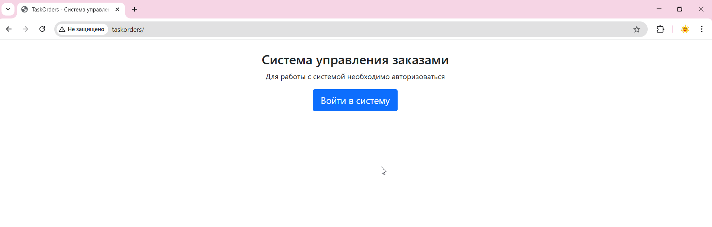
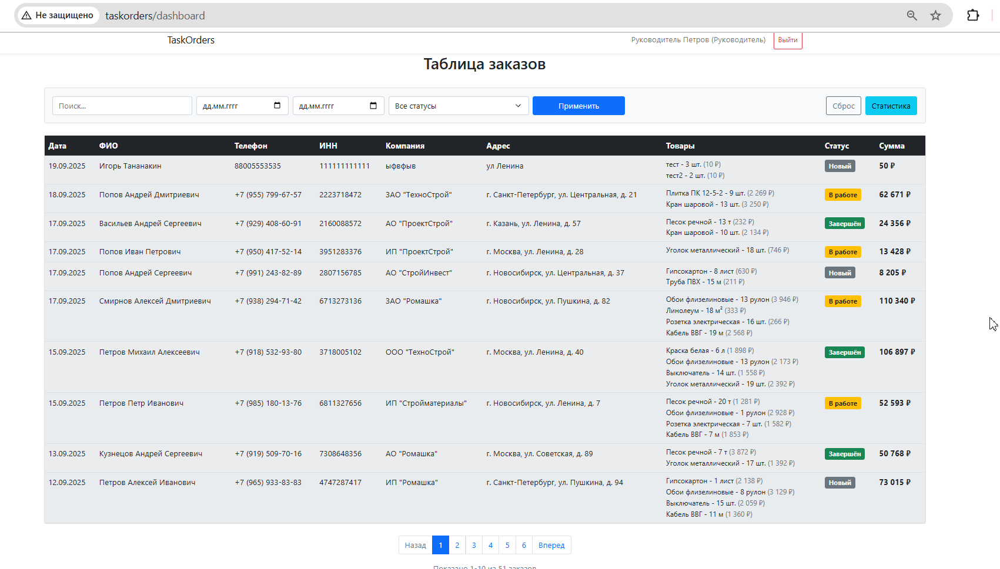
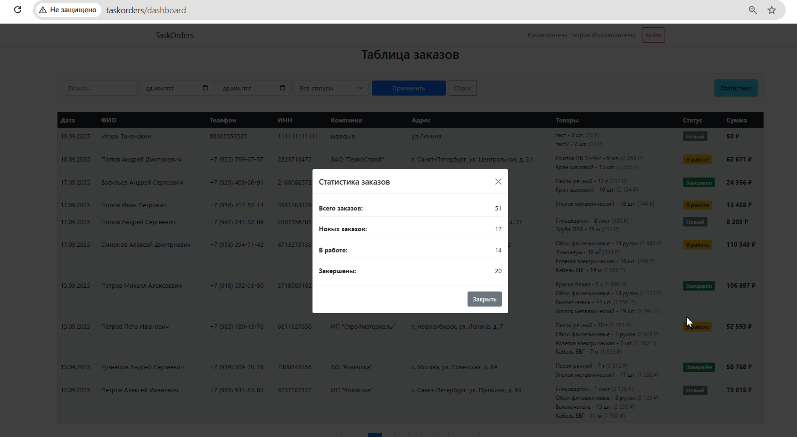
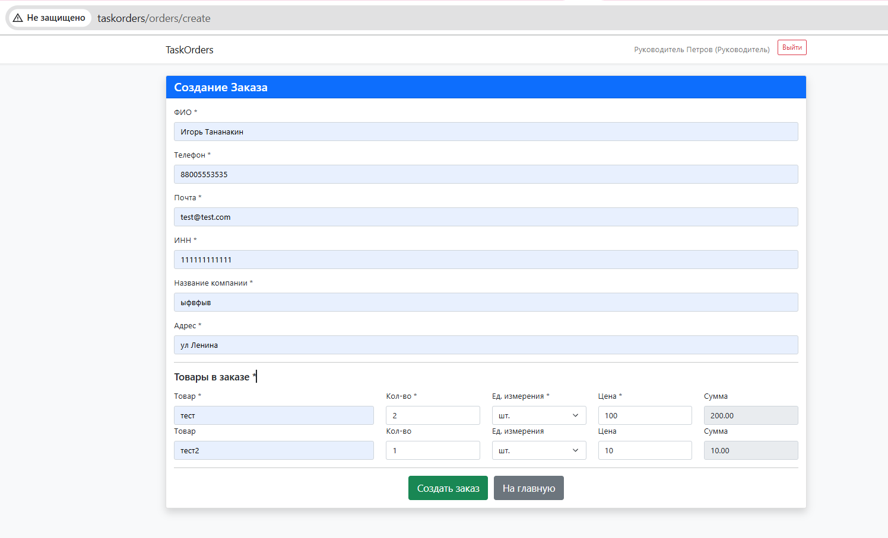
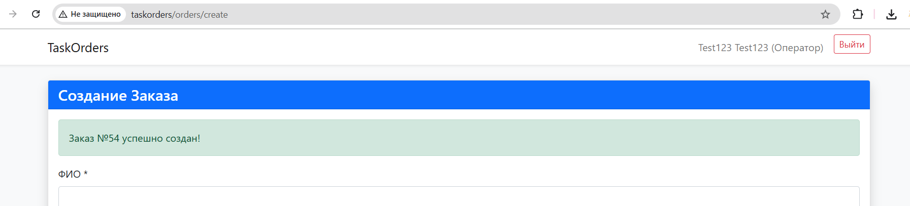

# TaskOrders - Система управления заказами
Техническое задние лежит в корне 1test_full_stack.pdf

## Описание проекта
1) Создание пользователей с ролями через консольные команды
2) Создание заказов с товарами через веб-интерфейс
3) Просмотр и фильтрация заказов для руководителя
4) Статистика по заказам

## Требования
- PHP 8.0+
- Laravel
- Composer
- Node.js 14+
- Vue
- npm
- База данных (MySQL)
- Git

## Установка проекта

### 1. Клонирование репозитория

### 2. Настройка окружения
```bash
DB_CONNECTION=mysql
DB_HOST=127.0.0.1
DB_PORT=3306
DB_DATABASE=taskorders
DB_USERNAME=root
DB_PASSWORD=
```

### 3. Установка зависимостей
```bash
composer install
npm install
```

### 4. Генерация ключа
```bash
php artisan key:generate
```

### 5. Запуск миграций
```bash
php artisan migrate
```

### 6. Конфигурация для vite.config.js
- не забыть подставить домен

### 7. Сборка фронтенда
```bash
npm run build
```

## Работа с проектом
### Команды

1) Создание пользователя руководителя:
```bash
php artisan user:create "Test Test" test_manager@gmail.com password123 --role=manager
```

2) Создание пользователя оператора:
```bash
php artisan user:create "Test2 Test2" test_operator@gmail.com password123 --role=operator
```

3) Заполнение тестовыми данными (все данные):

```bash
php artisan db:seed
```
4) Заполнение только пользователями:

```bash
php artisan db:seed --class=UserSeeder
```

5) Заполнение только товарами:

```bash
php artisan db:seed --class=ProductSeeder
```

6) Заполнение только заказами:

```bash
php artisan db:seed --class=OrderSeeder
```


## Действие на страницах
1) Главная страница (/)  авторизация пользователей



2) Дашборд руководителя /dashboard таблица заказов с фильтрацией и статистикой



модальное окно со статистикой



3) Создание заказа /orders/create форма создания нового заказа



4) успех создание заказа



